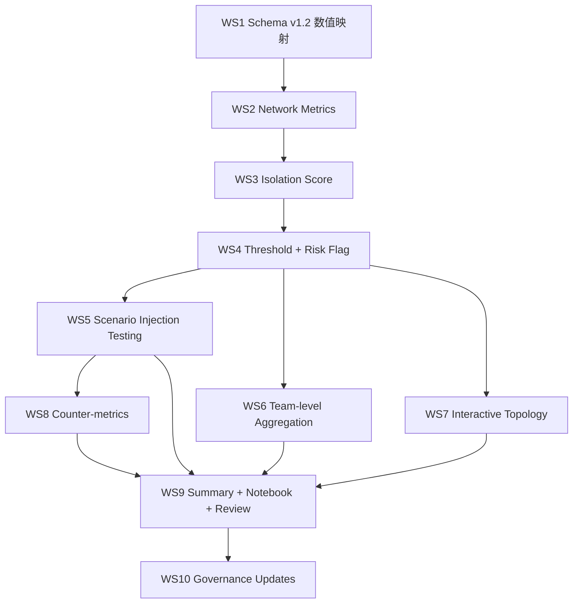

# Sprint 2 Enhanced Plan — Core ONA, Isolation Score & Interactive Topology

**Sprint**: 2 · Weeks 3–4
**Prerequisite**: Sprint 1 已完成（目录治理重构 + 数据生成 + DQ Gate PASS）
**Scope sources**: PID Sprint 2 定义（4 项）+ Martin Sprint 1 评审 5 条建议 + CEU 课程对 counter-metrics / validation 的硬要求

---

## 0. Definition of Done（Sprint 2 验收清单）

| # | 交付物 | 位置 |
| :-- | :-- | :-- |
| D1 | Schema v1.2.0：新增 `Interaction_Type_Code` 与 `Interaction_Frequency_Weight` 列的 `data/mock_data_edges.csv`；codebook 同步更新 | `data/`, `docs/mock_codebook.md`, `docs/CHANGELOG.md` |
| D2 | 节点指标表（含 in/out/betweenness centrality、Cross_Team_Tie_Count、Isolation Score、Isolation_Risk_Flag、三档分层标签） | `sprints/sprint2/outputs/sprint2_nodes_with_metrics.csv` |
| D3 | 个人静默名单（Top 20 高风险个人，含解释字段） | `sprints/sprint2/outputs/sprint2_silent_individuals_shortlist.md` |
| D4 | 团队静默聚合表（Team 级风险） | `sprints/sprint2/outputs/sprint2_silent_teams_aggregated.md` |
| D5 | Power User 集中度报告（Herfindahl + Top-5 hub 吸收比） | `sprints/sprint2/outputs/sprint2_power_user_concentration.md` |
| D6 | Scenario Injection Testing 验证报告（含 ROC-AUC、混淆矩阵、最优阈值推导） | `sprints/sprint2/outputs/sprint2_validation_report.md` |
| D7 | Counter-metrics 声明（至少 3 条 Guardrail/Tradeoff） | `sprints/sprint2/outputs/sprint2_counter_metrics.md` |
| D8 | 交互式拓扑图（pyvis，self-contained HTML） | `sprints/sprint2/outputs/sprint2_interactive_topology.html` |
| D9 | Sprint 2 汇总 + 评审包 | `sprints/sprint2/outputs/sprint2_summary_report.md`, `sprint2_review_pack.md` |
| D10 | Sprint 2 一键执行脚本 + 演示 notebook + README | `sprints/sprint2/run_sprint2.py`, `notebook.ipynb`, `README.md` |
| D11 | 治理更新：CHANGELOG v1.2.0、PID_delta_log 增补（如需）、requirements.txt 增加 pyvis | `docs/`, `Capstone/requirements.txt`（新建或已有） |

---

## 1. Workstream 1 — Schema v1.2.0：数值映射（Martin #3）

**目的**：按 Martin 要求把 `Interaction_Type` / `Interaction_Frequency` 数值化，算法和可视化层统一用数字；字符串列保留以便人工阅读和问卷回显。

### 1.1 新增列定义

| 新列 | 类型 | 映射规则 |
| :-- | :-- | :-- |
| `Interaction_Type_Code` | int | `Hard = 1`, `Soft = 0`（保留 2/3 作为未来扩展槽） |
| `Interaction_Frequency_Weight` | float, 0–1 | `Daily=1.00` / `Weekly=0.67` / `Monthly=0.33` / `Rarely=0.10`（指数衰减） |

### 1.2 落地方式

- 在 `src/generate_assets.py` 的 `build_edges()` 写入阶段直接增加两列（保留原字符串列）
- 重新跑 `python src/generate_assets.py` 生成带新列的 `data/mock_data_edges.csv`
- **Seed 不变**（5228），其他字段保持 bit-for-bit 一致（新列纯派生，不改已有值）

### 1.3 Codebook 更新要点（`docs/mock_codebook.md` Table 2）

- 新列定义 + 编码规则 + "保留 2/3 扩展槽"的说明
- 更新 "Tie strength mapping (Granovetter 1973)" 小节：同时列出整数 Granovetter 权重（4/3/2/1）与指数衰减权重（1.00/0.67/0.33/0.10），说明两套用途不同：整数用于传统 ONA 文献对齐；小数权重用于算法输入

### 1.4 DoD

- [ ] `data/mock_data_edges.csv` 有 2 个新列且 DQ Gate 仍然 PASS
- [ ] `docs/mock_codebook.md` 更新
- [ ] `docs/CHANGELOG.md` 追加 v1.2.0 条目

---

## 2. Workstream 2 — Network Metrics（PID 核心 + Martin #1 Boundary Spanning）

**依赖**：Workstream 1 已落地（读 `data/*.csv`）

### 2.1 建图

- `networkx.DiGraph`（有向）
- Edge weight = `Interaction_Frequency_Weight`（0.10 – 1.00）
- 节点属性挂 `Team` / `Seniority` / `Years_Exp` / `Profile_Type`

### 2.2 逐节点计算

| 指标 | 函数 | 用途 | 文献对齐 |
| :-- | :-- | :-- | :-- |
| `in_degree` | `G.in_degree()` | Hub 候选 | Cross & Parker "central connector" |
| `in_strength` | `G.in_degree(weight='weight')` | 加权 Hub | Granovetter tie strength |
| `out_degree` | `G.out_degree()` | Silent island 基线 | Cross & Parker |
| `out_strength` | `G.out_degree(weight='weight')` | 加权 Silent 基线 | |
| `betweenness_centrality` | `nx.betweenness_centrality(G, weight='weight')` | Broker / Bridge | Granovetter 1973 bridge 概念 |
| `Cross_Team_Tie_Count` | 自定义：`len({targets' Team} - {self.Team})` | Boundary spanner（跨 Team 广度）| **Cross & Parker 2004 boundary spanner 角色** |
| `Weak_Tie_Outbound_Count` | 自定义：该节点出向边中 `Weight ≤ 0.33` 的数量 | Granovetter weak tie | Granovetter 1973 |
| `Weak_Cross_Team_Tie_Count` | 自定义：出向边中既是 weak tie 又跨 Team 的数量 | Weak bridge 识别（服务 Isolation Score 子分数） | Granovetter + Cross & Parker |

**不加入**：Burt's constraint / effective size — 已决策，理由是超出两篇批准参考文献范围。

### 2.3 Power User 集中度指标（补 PID "preferential attachment / star network" 叙事）

- `Top5_Hub_Inbound_Share` = Top-5 in-degree 节点吸走的 inbound 总数 / 全网 inbound 总数
- `Inbound_Herfindahl_Index` = `sum((in_degree_i / total_inbound)^2)` across all nodes
- 两个数字合起来直接回答 PID "whether star network is fragile"

### 2.4 DoD

- [ ] `sprints/sprint2/outputs/sprint2_nodes_with_metrics.csv` 包含上述全部指标
- [ ] Power User 集中度结果进 `sprint2_power_user_concentration.md`

---

## 3. Workstream 3 — Isolation Score v1.0(PID 核心)

**依赖**：Workstream 2 完成。

### 3.1 四组件公式（与 codebook 对齐，等权 0.25）

$$
\text{Isolation\_Score} = 0.25 \cdot \text{OutboundScarcity} + 0.25 \cdot \text{WeakWeightShare} + 0.25 \cdot \text{TargetConcentration} + 0.25 \cdot \text{WeakBridgeDeficit}
$$

每个子分数归一化到 `[0, 1]`，写入 codebook：

| 组件 | 公式 | 归一化 |
| :-- | :-- | :-- |
| **OutboundScarcity** | 出向边少 ⇒ 分数高 | `1 - (out_degree / max_out_degree_in_cohort)` |
| **WeakWeightShare** | 出向边中 weak tie 占比高 ⇒ 分数高 | `count(weight ≤ 0.33) / total_outbound_count`（节点 out_degree=0 时定义为 1.0 = "默认最孤立"） |
| **TargetConcentration** | 出向对象集中于单人 ⇒ 分数高 | Herfindahl: `sum((count_to_target_i / total_out)^2)`（out_degree=0 定义为 1.0） |
| **WeakBridgeDeficit** | 缺少"弱-跨团队"桥 ⇒ 分数高 | `1 - (Weak_Cross_Team_Tie_Count / max_Weak_Cross_Team_Tie_Count_in_cohort)` |

### 3.2 Codebook 与 CHANGELOG 同步

- `docs/mock_codebook.md` 的 "Isolation Score" 章节补 4 条组件的完整公式 + 归一化 + 等权说明
- `docs/CHANGELOG.md` 在 v1.2.0 条目下加 "Isolation Score operationalization" 说明

### 3.3 DoD

- [ ] `Isolation_Score` 列（float 0–1）出现在 `sprint2_nodes_with_metrics.csv`
- [ ] Codebook 更新，公式与代码一对一可追溯

---

## 4. Workstream 4 — Threshold & Risk Flag（User 决策 5）

**依赖**：Workstream 3 完成。

### 4.1 ROC 最优阈值

- Ground truth：`y_true = (Profile_Type == 'island').astype(int)` （41 个已注入的 island）
- 评分：`y_score = Isolation_Score`
- 用 `sklearn.metrics.roc_curve` 或自实现，计算：
  - ROC-AUC
  - Youden's J statistic：`J = TPR - FPR`，取 J 最大点对应的 `Isolation_Score` 值为 τ_ROC
- `Isolation_Risk_Flag` = 1 if `Isolation_Score ≥ τ_ROC` else 0

### 4.2 三档分层（并行输出，不替代 τ_ROC）

| 档位 | 规则（分位数） | 管理含义 |
| :-- | :-- | :-- |
| **High** | Isolation_Score ≥ 75th percentile 且 ≥ τ_ROC | 立即干预 |
| **Medium** | 50th–75th percentile | 观察 + 定期回访 |
| **Low** | < 50th percentile | 无需干预 |

新列 `Isolation_Risk_Tier` ∈ {High, Medium, Low}。

### 4.3 DoD

- [ ] `Isolation_Risk_Flag` 和 `Isolation_Risk_Tier` 同时出现在 `sprint2_nodes_with_metrics.csv`
- [ ] `sprint2_validation_report.md` 记录 τ_ROC 取值、ROC-AUC、Youden's J 推导
- [ ] 三档分布统计（High/Medium/Low 各多少人）出现在 `sprint2_summary_report.md`

---

## 5. Workstream 5 — Scenario Injection Testing（PID §66 强制要求）

**依赖**：Workstream 4 完成。

### 5.1 验证目标

- 问题：Isolation Score 是否能精准识别 Sprint 1 注入的 41 个 `island` archetype，且不生成过多 false positive？

### 5.2 要输出的数字

| 指标 | 目标 | 通过标准 |
| :-- | :-- | :-- |
| ROC-AUC | 越高越好 | **≥ 0.80**（否则需回 Sprint 2 调归一化/权重） |
| τ_ROC 的 Sensitivity (TPR) | 越高越好 | ≥ 0.75 |
| τ_ROC 的 Specificity (TNR) | 越高越好 | ≥ 0.80 |
| 混淆矩阵 | 4 格 | 记录 TP/FP/TN/FN |
| `Profile_Type=='island'` 成员中的 Isolation_Score 分布 | 均值、中位数、与 balanced 的 Welch's t-test | 显著性 p < 0.01 |

### 5.3 失败处理剧本

- 如果 AUC < 0.80：优先回调 `WeakBridgeDeficit` 的归一化（它对 island 最敏感）；仍不行再讨论权重
- 把调整过程记录在 `sprint2_validation_report.md` 附录

### 5.4 DoD

- [ ] `sprint2_validation_report.md` 完整
- [ ] AUC ≥ 0.80 否则方案迭代直至达标

---

## 6. Workstream 6 — Team-Level Aggregation（PID "silent teams" + 我的缺口 1）

**依赖**：Workstream 4 完成。

### 6.1 聚合字段（每个 Team 一行，共 6 行）

| 列 | 计算 |
| :-- | :-- |
| `Team` | 6 个 team 名 |
| `Member_Count` | 该 team 的节点数 |
| `Avg_Isolation_Score` | mean |
| `Median_Isolation_Score` | median |
| `Pct_High_Risk` | High tier 成员占比 |
| `Pct_Medium_Risk` | Medium tier 成员占比 |
| `Has_Zero_Outbound_Member_Count` | 该 team 中 out_degree=0 的成员数 |
| `Team_Island_Status` | "Silent Team" if `Pct_High_Risk ≥ 40%`, "At Risk" if 20–40%, "Healthy" if <20% |

### 6.2 DoD

- [ ] `sprint2_silent_teams_aggregated.md` 按 `Avg_Isolation_Score` 降序排列，Team_Island_Status 列用 emoji 或星标视觉区分（避免 emoji 的话用 "●●●"/"●●○"/"●○○"）

---

## 7. Workstream 7 — Interactive Topology（Martin #4 + #5）

**依赖**：Workstream 4 完成。

### 7.1 技术路径（决策 4 确定：空间真聚拢）

```
intra-team edge weight = 3.0  ← 强拉力，同 team 互相吸引
inter-team edge weight = 1.0  ← 保留原频率权重作为基准
pos = nx.spring_layout(G, weight='layout_weight', seed=5228, iterations=200, k=...)
→ 把 pos 传给 pyvis.Network（set_options 禁用 physics 以固定位置）
```

### 7.2 节点编码

| 视觉通道 | 编码 |
| :-- | :-- |
| 位置 | spring layout 计算的 (x, y) |
| 颜色 | `Team`（6 种颜色，用色盲友好调色板如 ColorBrewer Set2）|
| 大小 | `in_degree`（半径正比）|
| 边框粗细 | `Isolation_Risk_Tier` (High=加粗红边 / Medium=中等橙边 / Low=细灰边) |
| 形状 | `Profile_Type`（可选：balanced=circle / hub=diamond / broker=triangle / island=square） |

### 7.3 Hover tooltip 内容

```
EMP_ID: EMP_247
Team: Solution Architecture
Seniority: Senior
Years_Exp: 12
In-degree: 24 | Out-degree: 6
Betweenness: 0.082
Cross-Team Tie Count: 4
Isolation Score: 0.18 (Tier: Low)
Profile Type: broker
```

### 7.4 边编码

- 边的粗细 = `Interaction_Frequency_Weight`
- 边颜色 = `Interaction_Type_Code`（Hard=深灰 / Soft=蓝）
- 鼠标 hover 边：显示 "Source → Target · Hard/Soft · Freq · Aware/Energy"

### 7.5 DoD

- [ ] `sprint2_interactive_topology.html` 单文件可运行（不依赖在线 CDN，或 CDN 失败时有 fallback 声明）
- [ ] 在 Chrome / Safari 打开无 console error
- [ ] 同 Team 节点在空间上明显聚拢（肉眼可辨）
- [ ] 点击 EMP_247 tooltip 显示上述所有字段

---

## 8. Workstream 8 — Counter-Metrics 声明（CEU 硬要求）

**依赖**：Workstream 5 完成（因为 counter-metrics 需基于实际误判样本写）。

### 8.1 必写 3 条

| # | Counter-metric | 类型 | 监控指标 |
| :-- | :-- | :-- | :-- |
| CM-1 | **新员工误报**：Years_Exp < 1 的员工在 onboarding 期 outbound 天然低，应被豁免 | Guardrail | `New_Hire_False_Positive_Rate` = Years_Exp<1 且 Isolation_Risk_Flag=1 的比例；目标 ≤ 10% |
| CM-2 | **少数语言使用者误伤**：B2/B3/B4（非英语主用）≥3 分的员工如果也被高分，警示可能是 Hub 偏见而非个人静默 | Guardrail | `Non_English_User_High_Risk_Rate`；需 sponsor 评审 |
| CM-3 | **Broker 不应被误判为 Island**：high betweenness 且 high Cross_Team_Tie_Count 的节点被 flag 为 High → 模型自相矛盾 | Tradeoff | `Broker_False_Positive_Count` = betweenness > 75th percentile 且 Isolation_Risk_Flag=1 的节点数；目标 = 0 |

### 8.2 DoD

- [ ] `sprint2_counter_metrics.md` 含 3 条及其当前 Sprint 2 数据上的取值

---

## 9. Workstream 9 — 汇总交付包 & Notebook & README

**依赖**：Workstream 2–8 完成。

### 9.1 必要文件（放 `sprints/sprint2/`）

- `README.md` — DoD 清单 + 文件索引 + 一键复现命令
- `notebook.ipynb` — 演示用，含 5–7 个 cell：读数据 → 指标 → Isolation Score → Scenario Injection → 显示 pyvis 图
- `run_sprint2.py` — 一键运行产出所有 D2-D9
- `presentation.html` — 沿用 Sprint 1 双语 HTML 模板（可选，Sprint 2 评审若时间紧可简化成短版）

### 9.2 DoD

- [ ] `python sprints/sprint2/run_sprint2.py` 能一键产出 D2–D9
- [ ] notebook 可在 Jupyter 里无报错执行

---

## 10. Workstream 10 — 治理更新

- `docs/CHANGELOG.md` 追加 **v1.2.0**（schema v1.2 + Isolation Score v1.0 + Sprint 2 交付）
- `docs/PID_delta_log.md`：如果 Sprint 2 产生新的 PID 偏差（例如阈值策略与 PID 文字不完全一致），加 D-06
- 项目根新建或更新 `Capstone/requirements.txt`：
  ```
  pandas>=1.5
  Pillow>=10
  networkx>=3
  pyvis>=0.3
  scikit-learn>=1.3
  ```

---

## 11. 依赖与执行顺序



建议按 **WS1 → WS2 → WS3 → WS4 → (WS5 ∥ WS6 ∥ WS7) → WS8 → WS9 → WS10** 顺序执行。WS5/6/7 之间彼此独立，可并行。

---

## 12. 代码模块建议布局

```
Capstone/
├── src/
│   ├── generate_assets.py            （Sprint 1 旧，本 Sprint 加 schema v1.2 两列）
│   ├── metrics.py                    （新）WS2 的 centrality + Cross_Team_Tie_Count + Power User concentration
│   ├── isolation_score.py            （新）WS3 四组件 + 归一化 + 等权聚合
│   ├── threshold.py                  （新）WS4 ROC 最优 + 三档分层
│   └── viz.py                        （新）WS7 pyvis 构图 + spring layout + tooltip 模板
└── sprints/sprint2/
    ├── run_sprint2.py                （新）一键编排 WS2–WS9
    ├── notebook.ipynb                （新）演示版
    ├── README.md                     （新）DoD 清单
    └── outputs/                      （新）D2–D9 全部放这里
```

**原则**：可复用逻辑放 `src/`（跨 Sprint 可用）；Sprint 专属编排脚本放 `sprints/sprint2/`。

---

## 13. 可追溯性矩阵（PID × Martin × 课程要求 × Workstream）

| 要求来源 | 条目 | 落地在 Workstream | 交付物 |
| :-- | :-- | :-- | :-- |
| PID Sprint 2 | In/Out/Betweenness Centrality | WS2 | D2 |
| PID Sprint 2 | Isolation Score | WS3 | D2 |
| PID Sprint 2 | Central Hubs 识别 + Power User | WS2 | D5 |
| PID Sprint 2 | Brokers / Bridges 识别 | WS2（betweenness + Cross_Team_Tie_Count）| D2 |
| PID Sprint 2 | Silent Islands（个人）| WS4 | D3 |
| PID Sprint 2 | Silent Islands（团队）| WS6 | D4 |
| PID Sprint 2 | Dynamic Network Topology Map | WS7 | D8 |
| PID Sprint 2 | Management shortlist | WS4 + WS6 | D3 + D4 |
| PID §66 | Scenario Injection Testing | WS5 | D6 |
| Martin #1 | Boundary Spanning 概念 | WS2（Cross_Team_Tie_Count）| D2 + Sprint 2 summary |
| Martin #2 | Scalability | **延至 Sprint 4** | 无 Sprint 2 交付 |
| Martin #3 | 数值映射 | WS1 | D1 |
| Martin #4 | Team 聚类 | WS7 | D8 |
| Martin #5 | 交互 hover/click | WS7 | D8 |
| CEU 课程 | Counter-metrics | WS8 | D7 |
| 项目治理 | CHANGELOG + PID delta + requirements | WS10 | D11 |

---

## 14. Sprint 2 结束时 Sponsor 评审的叙事骨架（给 Martin 看什么）

按重要性排序的 5 页评审流程（预估 30 分钟会议）：

1. **打开 `sprint2_interactive_topology.html`**（可视化击中 Martin 全部期望） — 5 分钟
2. **`sprint2_silent_teams_aggregated.md`** — 团队级风险热图 — 5 分钟
3. **`sprint2_silent_individuals_shortlist.md`** Top 20 + 解释字段 — 5 分钟
4. **`sprint2_validation_report.md`** — ROC-AUC 图 + τ_ROC 推导 + Scenario Injection 验证通过 — 10 分钟（这是 Sponsor "credibility check" 的关键环节）
5. **`sprint2_counter_metrics.md` + `sprint2_power_user_concentration.md`** — 展示模型的风险识别 + 对 PID "preferential attachment" 提问的直接回答 — 5 分钟

---

## 15. 风险登记表（前置到计划里，避免 Sprint 结束才补）

| # | 风险 | 缓解 |
| :-- | :-- | :-- |
| R1 | Scenario Injection Testing 的 ROC-AUC 不达 0.80 | WS5 § 5.3 失败剧本，优先调 WeakBridgeDeficit 归一化 |
| R2 | pyvis spring layout 不收敛到明显聚团 | 调大 intra-team weight 到 5.0；或 fallback 到手动 sector 布局 |
| R3 | 41 个 island 过少导致 AUC 估计方差大 | `Scenario Injection` 报告中汇报 95% CI；若 CI 过宽，申请临时增大 N_nodes 至 500 再跑一次对照 |
| R4 | pyvis 默认 HTML 大小超标（几百 KB edges 情况会卡浏览器）| 只渲染 Top 200 in-degree 节点 + 他们的邻居；全量数据仍在 CSV 中 |
| R5 | Sprint 2 时间紧，交互图是最大不确定性 | WS7 可拆分成 P0（hover 版）和 P1（形状/边框精修）；P0 必须完成，P1 时间允许再做 |

---

*End of Sprint 2 Enhanced Plan · 依赖确认后可直接投递给 Agent mode 执行。*
